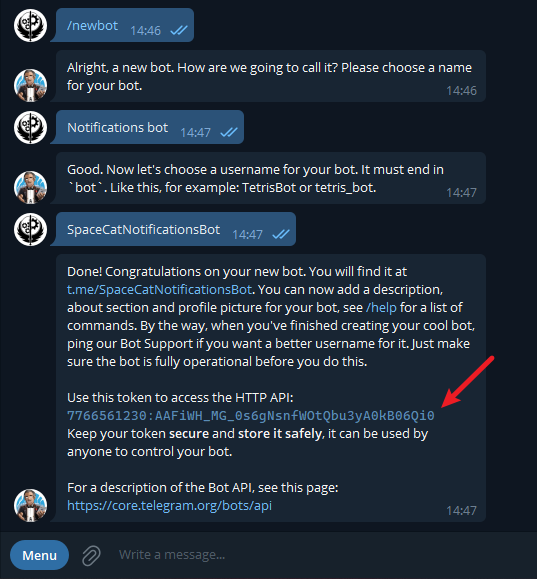
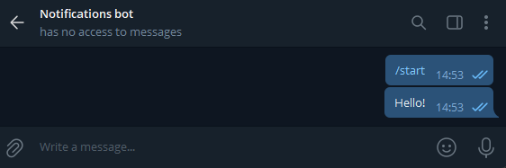
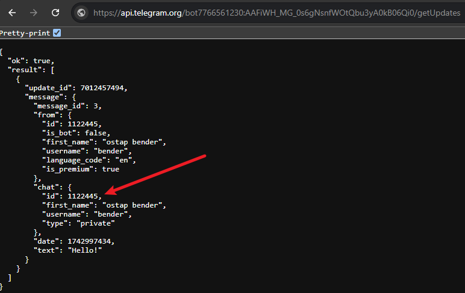

# How to Create a Telegram Bot and Send Messages

This guide will walk you through creating a Telegram bot, retrieving your chat ID, and sending messages using the [telegram-owl](https://github.com/beeyev/telegram-owl) CLI tool.

---

## Step 1: Create a Telegram Bot and Get a Token

1. Open Telegram application then search for `@BotFather` or click [here](https://t.me/BotFather)
2. Click **Start**
1. Click Menu -> /newbot or type `/newbot` and hit Send
4. Follow the instructions:
    - Choose a **name** for your bot
    - Choose a **username** (must end with `bot`, e.g. `SpaceCatNotificationsBot`)
5. You will receive a response like:

    ```
    Done! Congratulations on your new bot. You will find it at t.me/SpaceCatNotificationsBot.

    Use this token to access the HTTP API:
    123456789:ABCdefGhIJkLmNoPQRstuVWXyz12345678
    ```

6. **Copy and securely store the token**. This is your bot's authentication key — **do not share it publicly**.

   

---

## Step 2: Get Chat ID for a Private Chat (1-on-1)

1. Open a chat with your new bot in Telegram
2. Click **Start** and send any message (e.g. "hello")

   

3. In your browser, open the following URL (replace `{TOKEN}` with your actual bot token):

    ```bash
    https://api.telegram.org/bot{TOKEN}/getUpdates
    ```

   Example:
    ```bash
    https://api.telegram.org/bot123456789:ABCdefGhIJkLmNoPQRstuVWXyz12345678/getUpdates
    ```

4. You'll see a JSON response like this (if not, send another message to the bot and refresh the page):

   

5. Find the `chat id` value inside `result[0].message.chat.id`.  
   This is your **chat ID**, e.g. `1122445`.

---

### ✅ Test It!

Once you have your **bot token** and **chat ID**, you can send your first message using:

```bash
telegram-owl --token=123456789:ABCdef --chat=1122445 --message="🚀 Hello from Telegram Owl!"
```

You’re ready to go! 🦉

---

For more advanced usage, you can find information on how to get chat id for a channel, group chat, or a topic in a group chat in the following sections:

## 📢 Get Chat ID for a Channel

1. Add your Telegram bot into a channel
2. Send a random message to the channel
3. Visit the same URL:

    ```bash
    https://api.telegram.org/bot{TOKEN}/getUpdates
    ```

4. Look for a JSON response like:

    ```json
    {
      "ok": true,
      "result": [
        {
          "channel_post": {
            "chat": {
              "id": -1001234567890,
              "title": "My Channel",
              "type": "channel"
            },
            "text": "Test message"
          }
        }
      ]
    }
    ```

5. The `chat.id` is your **channel ID**. Channel IDs **start with `-100`**, e.g. `-1001234567890`.

---

## 👥 Get Chat ID for a Group Chat

This method works best using the Telegram **desktop app**.

1. Add your bot to the group chat
2. Send a message to the group
3. Right-click on the message and select **Copy Message Link**
4. The link looks like this:

    ```bash
    https://t.me/c/194xxxx987/11/13
    ```

5. The number after `/c/` is your **group ID**: `194xxxx987`  
   To use it in the API, prefix it with `-100`, resulting in: `-100194xxxx987`

---

## 🧵 Get Topic ID for a Group Chat (Forum Thread)

To send a message to a specific **topic (thread)** inside a group chat:

1. Copy a message link from the topic using **Copy Message Link**
2. Example link:

    ```bash
    https://t.me/c/194xxxx987/11/13
    ```

3. The number after `/c/194xxxx987/` is the **topic ID**: `11`

Use this ID with the `--thread` flag in `telegram-owl`.
